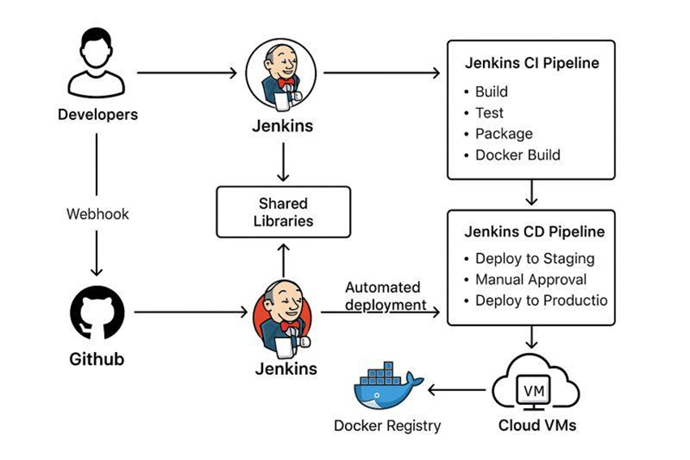
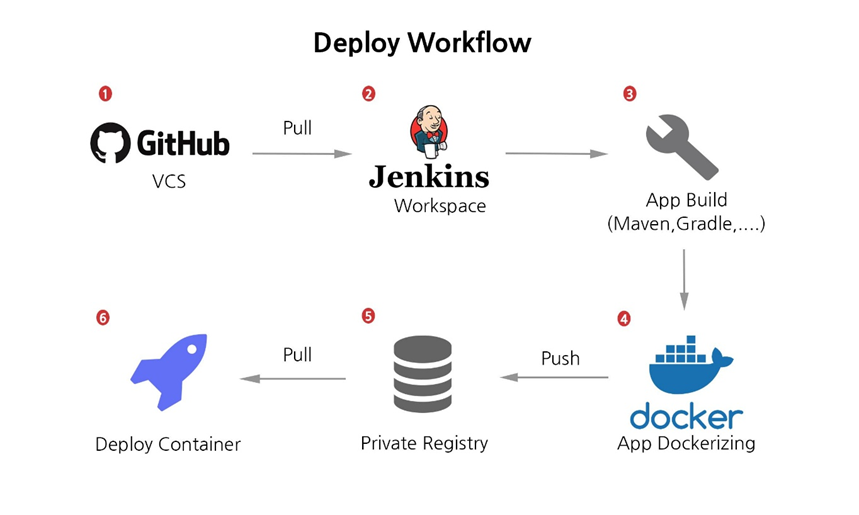

# 🚀 DevOps CI/CD Pipeline Automation

A complete DevOps CI/CD Pipeline Automation project demonstrating Continuous Integration and Continuous Deployment using Spring Boot, Jenkins, Maven, Docker, GitHub Webhooks, ngrok, Docker Hub, and Vagrant Ubuntu Virtual Machine.

The project automates the entire software delivery lifecycle from code commit to deployment with minimal manual intervention.

---

# 📌 Project Overview

This project implements a fully automated CI/CD pipeline where source code changes pushed to GitHub automatically trigger Jenkins pipelines, build the application using Maven, create Docker images, push them to Docker Hub, and deploy the application using Docker containers.

The pipeline ensures:

- Faster software delivery
- Reduced manual deployment effort
- Consistent deployment environment
- Automated build and deployment process
- Improved software quality

---

# 🏗️ Architecture Diagram

## CI/CD Pipeline Architecture



---

## Deployment Workflow Architecture



---

# 🛠️ Technology Stack

| Technology | Purpose |
|------------|----------|
| Spring Boot | Backend Application |
| Java | Programming Language |
| Maven | Build Automation |
| Jenkins | CI/CD Automation |
| Docker | Containerization |
| GitHub | Source Code Management |
| GitHub Webhooks | Pipeline Triggering |
| ngrok | Public Tunnel |
| Docker Hub | Container Registry |
| Vagrant | VM Provisioning |
| Ubuntu VM | Deployment Environment |

---

# ✨ Key Features

## Continuous Integration

- Automated source code integration
- GitHub repository monitoring
- Jenkins build automation
- Maven project compilation
- Automated testing workflow

## Continuous Deployment

- Docker image generation
- Docker Hub image push
- Automated deployment
- Containerized application delivery

## DevOps Automation

- GitHub Webhook integration
- Jenkins Pipeline automation
- Docker deployment workflow
- End-to-end CI/CD implementation

---

# 📂 Project Structure

```text
DevOps-CI-CD-Pipeline/
│
├── src/
│   └── main/
│       ├── java/
│       │   └── HelloController.java
│       │
│       └── resources/
│           └── static/
│               └── images/
│                   ├── pipeline.png
│                   ├── workflow.png
│                   ├── img1.png
│                   ├── img2.png
│                   └── ...
│
├── Dockerfile
├── Jenkinsfile
├── pom.xml
├── README.md
│
└── target/
```

---

# ⚙️ CI/CD Workflow

```text
Developer
    │
    ▼
GitHub Push
    │
    ▼
GitHub Webhook
    │
    ▼
ngrok Tunnel
    │
    ▼
Jenkins Pipeline
    │
    ├── Source Checkout
    ├── Maven Build
    ├── Unit Testing
    ├── Docker Build
    ├── Docker Push
    └── Deployment
    │
    ▼
Docker Container
    │
    ▼
Spring Boot Application
```

---

# 🚀 Pipeline Stages

## Stage 1: Source Control

Developer pushes code changes to GitHub.

```bash
git add .
git commit -m "Updated application"
git push origin main
```

---

## Stage 2: Webhook Trigger

GitHub automatically sends a webhook request to Jenkins.

---

## Stage 3: Build Process

Jenkins executes Maven build commands.

```bash
mvn clean package
```

---

## Stage 4: Docker Image Build

```bash
docker build -t devops-app .
```

---

## Stage 5: Docker Hub Push

```bash
docker push username/devops-app
```

---

## Stage 6: Deployment

```bash
docker run -d -p 8080:8080 devops-app
```

---

# 🐳 Docker Commands

## Build Docker Image

```bash
docker build -t devops-app .
```

## List Docker Images

```bash
docker images
```

## Run Docker Container

```bash
docker run -d -p 8080:8080 devops-app
```

## Check Running Containers

```bash
docker ps
```

## Stop Container

```bash
docker stop <container-id>
```

## Remove Container

```bash
docker rm <container-id>
```

---

# 🔧 Jenkins Pipeline Workflow

```text
Checkout Source Code
        │
        ▼
Build Project (Maven)
        │
        ▼
Run Tests
        │
        ▼
Create Docker Image
        │
        ▼
Push Image To Docker Hub
        │
        ▼
Deploy Container
        │
        ▼
Application Available
```

---

# 🌐 ngrok Configuration

Expose Jenkins Server:

```bash
ngrok http 8080
```

Example:

```text
https://abc123.ngrok-free.app
```

Used to receive GitHub webhook requests.

---

# 📡 GitHub Webhook Configuration

Webhook URL:

```text
http://<ngrok-url>/github-webhook/
```

Content Type:

```text
application/json
```

Trigger:

```text
Push Event
```

---

# 🚀 Running the Project

## Clone Repository

```bash
git clone https://github.com/your-username/your-repository.git
```

```bash
cd your-repository
```

---

## Build Application

```bash
mvn clean package
```

---

## Run Application

```bash
mvn spring-boot:run
```

---

## Access Application

```text
http://localhost:8080
```

---

## Health Endpoint

```text
http://localhost:8080/health
```

Response:

```text
APPLICATION UP
```

---

## Version Endpoint

```text
http://localhost:8080/version
```

Response:

```text
Version 2.0.0
```

---

# 📊 Project Statistics

| Metric | Value |
|----------|----------|
| Pipeline Automation | 100% |
| Technologies Used | 8+ |
| Deployment Type | Containerized |
| CI/CD Workflow | Automated |
| Screenshots Captured | 55+ |
| Build Tool | Maven |
| Container Platform | Docker |
| CI/CD Server | Jenkins |

---

# 🎯 Learning Outcomes

Through this project, the following DevOps concepts were implemented and explored:

- Continuous Integration (CI)
- Continuous Deployment (CD)
- Jenkins Automation
- GitHub Webhooks
- Docker Containerization
- Docker Hub Registry
- Build Automation using Maven
- Infrastructure Virtualization using Vagrant
- Ubuntu Server Administration
- Deployment Automation

---

# 👨‍💻 Author

**Komal Joshi**

B.Tech Computer Science Engineering

DevOps | Cloud | Full Stack Development | Software Engineering

---

# ⭐ Acknowledgement

This project was developed to demonstrate practical implementation of modern DevOps practices including CI/CD automation, containerization, deployment orchestration, and infrastructure provisioning using industry-standard tools.

---

## ⭐ If you found this project useful, consider giving it a star on GitHub.